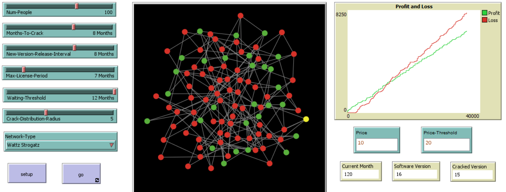

# Software Piracy ⭐

The illegal use of software or software piracy as known more formally, is one
of the most growing problems in computer science today. This paper examines
the agent based model of software piracy based on prior researches conducted
by various scholars. The agent based model can be used by organizations and
industries to curb the practice of software piracy leading to intellectual theft. The
model was simulated on watts strogatz and preferential attachment networks while
varying several parameters. The results indicate that software costs have a positive
effect on software piracy. The more the cost of a software, the more benefit in
distributing the pirated software. Subjective norms or peer pressure also plays a
positive role in software piracy if the peers are supportive of piracy. These results
can be incorporated by firms and organizations to develop strategies to mitigate the
effects of software piracy.

Refer [here](./Software_Piracy_Presentation.pdf) for **Project presentation** of the model.

Refer [here](./Software_Piracy_Report.pdf) for **Research Paper** of the model.

## Model Summary 🔥

Software piracy leads to loss of billions of dollars to the software industry annually. It is defined as
“the unauthorized copying of an organization’s internally developed software or illegal duplication of
commercially available software to avoid fees” (Wagner Sanders, 2001, p. 163). In the Computer
Software Copyright Act of 1980, software was recognized as intellectual property, thus enabling
compiled applications to be copyrighted (Craig & Burnett, 2005). Although software piracy is
considered to be a federal offense (Craig & Burnett, 2005), the Business Software Alliance (BSA)
established in 1988 as an anti-piracy alliance, reported in 2016 that 39% of computers had pirated
software installed on them (Wu, Nan, & Li, 2018). According to the No Electronic Theft (NET) law
passed in 1997, individuals who violate it are subject to up to five years in prison and $250,000 in
fines (Craig & Burnett, 2005).
But why are people willing to readily download pirated software despite such punishments in place?
Is it due to negligence of the laws or due to inherent behaviour? What affects the choice of individuals
to download pirated software? Understanding the behaviour patterns of individuals leading to
downloading of pirated software can help organizations prepare measures to counteract them. The
agent based model described here is based on the research "Software Piracy in the Workplace" (Peace
et al. 2003). The model tries to simulate very basic behaviour of individuals based on some portions
of the proposed theories, namely expected utility theory and the theory of planned behaviour (Peace
et al. 2003).

## Model and Instructions to run 🔥

- The model has documentation in ODD protocol, which can be found in the info tab of the model. 
- This model has been created in netlogo version 6.2. Kindly download netlogo 6.2 and use it to run the model 

